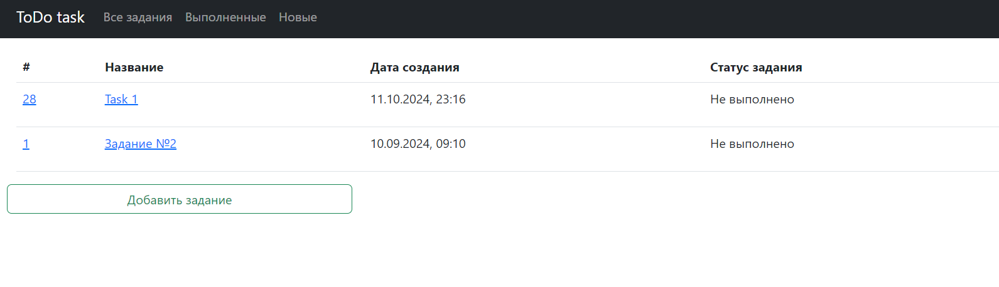
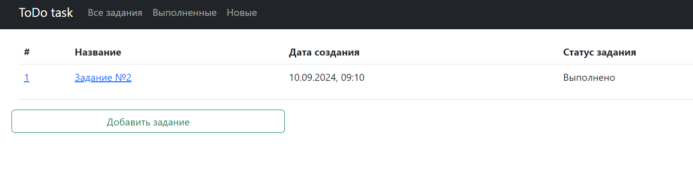
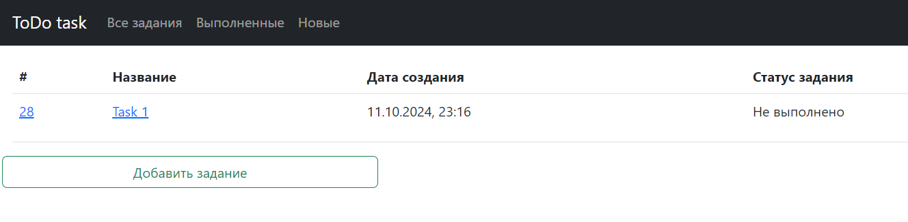
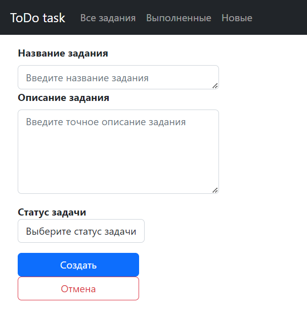

# job4j_todo

### Создание сайта с задачками в стиле To-Do

Реши задачку, получи печеньку

### ПО и инструменты

_JAVA 17_

_Hibernate 5.6.11.Final_

_Lombok 1.18.30_

_PostgreSQL 42.2.2_

_Maven 4.0_

_Liquibase 4.15.0_

_CheckStyle 3.1.2_

_Mockito_

_Spring Boot_

_Sql2o 1.6.0_

_H2 2.2.224_

_css_

_js_

### Для запуска приложения

1. ``` shell
   create database todo;
   ```


2. ``` shell 
   liquibase:update
    ```

3. ```shell
    Main.java
    ```

http://localhost:8080/tasks

На главной странице есть список всех заданий.  


Также есть вкладки:

- __Всё__ - открывается страница со всеми заданиями




- __Выполненные__ - открывается страница с только выполненными заданиями




- __Новые__ - открывается страница с только новыми заданиями




И кнопка:

- __Добавить задание__ - При нажатии на неё осуществляется переход на страницу добавления нового задания.





При нажатии на название или id задания - вы переходите на страницу подробного описания задания


На этой странице есть три кнопки:

- __Редактировать__ - при нажатии открывается страница с редактированием задания


- __Выполнить__ - при нажатии статус задания из Нового меняется на Выполнено

- __Удалить__ - при нажатии задание удаляется


__Страница регистрации__


__Страница входа в личный кабинет__


__Ошибка регистрации__

